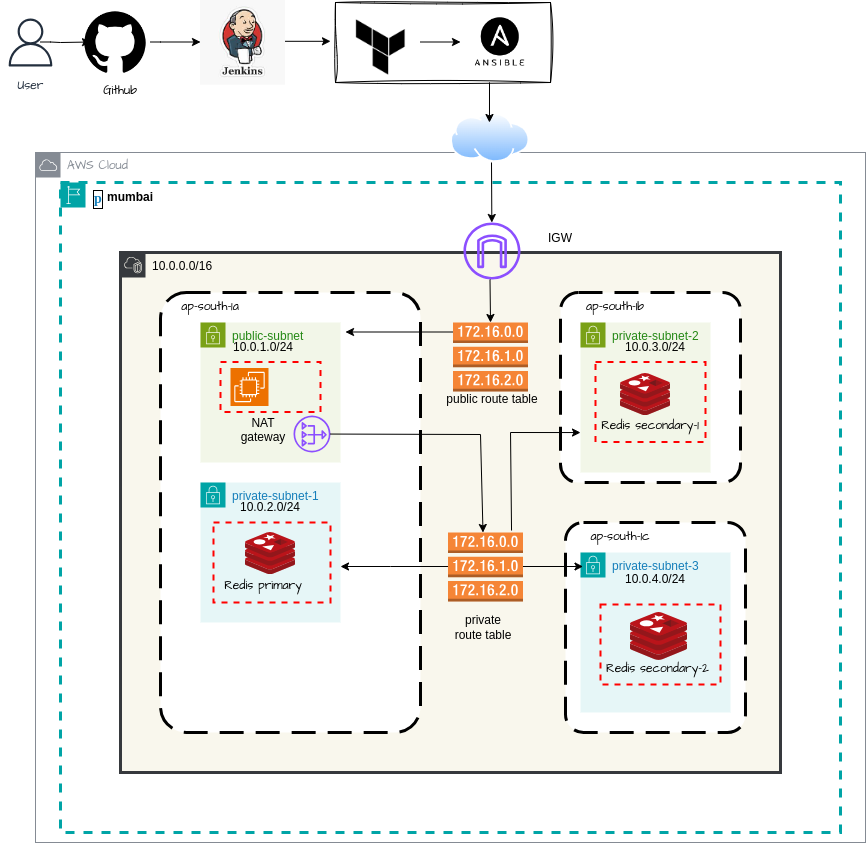

# Redis Infrastructure Deployment on AWS

This project provides a robust and automated solution for deploying a Redis infrastructure on Amazon Web Services (AWS). It leverages Terraform for infrastructure provisioning and Ansible for Redis installation and configuration, ensuring a scalable, secure, and easily manageable setup.

## Table of Contents

- [Architecture](#architecture)
- [Features](#features)
- [Prerequisites](#prerequisites)
- [Setup and Configuration](#setup-and-configuration)
- [Deployment](#deployment)
  - [Manual Deployment](#manual-deployment)
  - [CI/CD with Jenkins](#cicd-with-jenkins)
- [Usage](#usage)
- [Cleanup](#cleanup)
- [Troubleshooting](#troubleshooting)
- [Contributing](#contributing)
- [License](#license)

## Architecture

The infrastructure is designed to be highly available and secure, utilizing AWS services to host Redis instances. Key components include:

-   **Virtual Private Cloud (VPC):** A logically isolated section of the AWS Cloud where you can launch AWS resources.
-   **Subnets:** Public and private subnets within the VPC to control network access.
-   **EC2 Instances:** Amazon EC2 instances serve as the hosts for the Redis servers.
-   **Security Groups:** Act as virtual firewalls to control inbound and outbound traffic to the EC2 instances.
-   **VPC Peering (Optional):** Allows for private connectivity between two VPCs, enabling communication between instances in different VPCs as if they were within the same network.



## Features

-   **Automated Infrastructure Provisioning:** Uses Terraform to define and provision all necessary AWS resources.
-   **Automated Redis Deployment:** Employs Ansible to install, configure, and manage Redis on EC2 instances.
-   **Scalable:** Easily adjust the number of Redis instances by modifying Terraform variables.
-   **Secure:** Configures security groups to restrict access to Redis ports.
-   **Idempotent Deployments:** Both Terraform and Ansible ensure that deployments are repeatable and consistent.
-   **CI/CD Integration:** Includes a Jenkinsfile for automated deployment pipelines.

## Prerequisites

Before you begin, ensure you have the following installed and configured:

-   **AWS Account:** An active AWS account.
-   **AWS CLI:** Configured with appropriate credentials and default region.
    ```bash
    aws configure
    ```
-   **Terraform:** [Install Terraform](https://learn.hashicorp.com/tutorials/terraform/install-cli)
-   **Ansible:** [Install Ansible](https://docs.ansible.com/ansible/latest/installation_guide/intro_installation.html)
-   **SSH Key Pair:** An AWS EC2 key pair for SSH access to instances. Ensure the private key (`.pem` file) is accessible.
-   **Jenkins (Optional):** If you plan to use the CI/CD pipeline.
-   **Docker (Optional):** If you plan to run Jenkins in a Docker container.

## Setup and Configuration

1.  **Clone the Repository:**
    ```bash
    git clone https://github.com/your-repo/redisdemo.git
    cd redisdemo
    ```

2.  **AWS Credentials:**
    Ensure your AWS CLI is configured with credentials that have permissions to create EC2 instances, VPCs, security groups, etc.

3.  **Terraform Configuration:**
    Navigate to the `terraform/` directory.
    ```bash
    cd terraform/
    ```
    Review and modify the `variables.tf` file to suit your needs. Key variables include:
    -   `aws_region`: Your desired AWS region.
    -   `instance_type`: EC2 instance type for Redis servers.
    -   `key_name`: The name of your AWS EC2 key pair.
    -   `vpc_cidr_block`: CIDR block for your VPC.
    -   `public_subnet_cidr_block` and `private_subnet_cidr_block`: CIDR blocks for your subnets.

    Initialize Terraform:
    ```bash
    terraform init
    ```

4.  **Ansible Inventory:**
    The Ansible playbooks expect a dynamic inventory. After Terraform creates the EC2 instances, you will need to update your Ansible inventory file (e.g., `ansible/inventory.ini` or use `aws_ec2.yaml` for dynamic inventory) with the public IP addresses of the newly created instances.

    Example `ansible/inventory.ini` (after Terraform deployment):
    ```ini
    [redis_servers]
    <public_ip_1> ansible_user=ec2-user ansible_ssh_private_key_file=/path/to/your/key.pem
    <public_ip_2> ansible_user=ec2-user ansible_ssh_private_key_file=/path/to/your/key.pem
    ```
    Alternatively, you can use the `aws_ec2.yaml` file for dynamic inventory. Ensure you have the `boto3` and `botocore` Python libraries installed for dynamic inventory to work.

## Deployment

### Manual Deployment

1.  **Provision Infrastructure with Terraform:**
    From the `terraform/` directory:
    ```bash
    terraform plan
    terraform apply --auto-approve
    ```
    This will output the public IP addresses of your EC2 instances.

2.  **Configure Redis with Ansible:**
    Update your Ansible inventory with the public IPs from the Terraform output.
    Navigate back to the project root directory.
    ```bash
    cd ..
    ```
    Run the Ansible playbook:
    ```bash
    ansible-playbook -i ansible/aws_ec2.yaml playbook.yml --private-key /path/to/your/key.pem
    ```
    (Replace `/path/to/your/key.pem` with the actual path to your private key).

### CI/CD with Jenkins

The `Jenkinsfile` in the root directory defines a CI/CD pipeline for automated deployment. This pipeline typically includes stages for:

-   **Terraform Plan:** Generates an execution plan.
-   **Terraform Apply:** Applies the infrastructure changes.
-   **Ansible Playbook:** Runs the Ansible playbook to configure Redis.

To use the Jenkins pipeline:

1.  Set up a Jenkins server.
2.  Install necessary Jenkins plugins (e.g., Pipeline, AWS CLI, SSH Agent).
3.  Configure AWS credentials in Jenkins.
4.  Create a new Pipeline job in Jenkins, pointing to the `Jenkinsfile` in your repository.
5.  Trigger the build to deploy the infrastructure and Redis.

## Usage

Once Redis is deployed, you can connect to your Redis instances using the `redis-cli` or any Redis client library.

1.  **SSH into an EC2 instance:**
    ```bash
    ssh -i /path/to/your/key.pem ec2-user@<public_ip_of_redis_instance>
    ```

2.  **Connect to Redis:**
    ```bash
    redis-cli
    ```
    You can then run Redis commands, e.g., `SET mykey "Hello Redis"`, `GET mykey`.

## Cleanup

To destroy all the AWS resources provisioned by Terraform:

From the `terraform/` directory:
```bash
terraform destroy --auto-approve
```

## Troubleshooting

-   **SSH Connection Issues:**
    -   Ensure your security group allows inbound SSH (port 22) from your IP address.
    -   Verify your SSH key pair is correct and has the right permissions (`chmod 400 /path/to/your/key.pem`).
    -   Check the instance status in the AWS EC2 console.
-   **Ansible Connection Issues:**
    -   Ensure the EC2 instances are running and reachable via SSH.
    -   Verify the `ansible_user` and `ansible_ssh_private_key_file` in your inventory are correct.
    -   Check if Python is installed on the EC2 instances (Ansible requires Python).
-   **Redis Not Running:**
    -   SSH into the instance and check Redis logs (e.g., `/var/log/redis/redis-server.log`).
    -   Verify the Redis service status: `sudo systemctl status redis`.
    -   Check the Redis configuration file (`/etc/redis/redis.conf` or as defined in `ansible/roles/redis/templates/redis.conf.j2`).

## Contributing

Contributions are welcome! Please follow these steps:

1.  Fork the repository.
2.  Create a new branch (`git checkout -b feature/your-feature-name`).
3.  Make your changes.
4.  Commit your changes (`git commit -m 'Add new feature'`).
5.  Push to the branch (`git push origin feature/your-feature-name`).
6.  Open a Pull Request.

## License

This project is licensed under the MIT License - see the `LICENSE` file for details. (Note: A `LICENSE` file is not currently present in the repository. Consider adding one.)